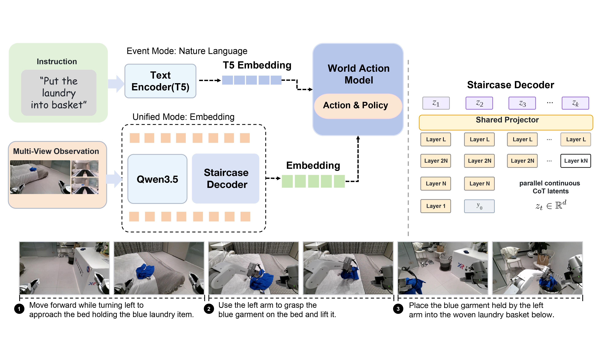

# X-Planner

### Event-Structured Task Planning for Embodied Intelligence

<p align="right">
  <strong>English</strong> | <a href="README_zh.md">简体中文</a>
</p>

<p align="center">
  <a href="https://x-square-robot.github.io/Xplanner/">Project Page</a> ·
  <a href="https://github.com/X-Square-Robot/Xplanner">GitHub</a> ·
  <a href="docs/paper/X_Planner_Event_Structured_Task_Planning_for_Embodied_Intelligence.pdf">Paper</a> ·
  <a href="docs/release_artifacts.md">Release artifacts</a>
</p>

X-Planner is a task-planning front end for long-horizon robot manipulation. Given a high-level
instruction, synchronized multi-view observations, and optional execution history, it represents
the next behavior as an action-grounded event and passes that representation to a downstream
world-action model.

<p align="center">
  
</p>

The project follows three ideas from the accompanying report:

- **Event-grounded data.** Demonstrations are synchronized and organized as a nested
  Task/Subtask/Action/Segment hierarchy.
- **Structured planning states.** Training examples materialize an initial plan, an ongoing event
  state, or an episode-end state as deterministic JSON.
- **Two planning interfaces.** Event mode exposes readable event states; unified mode uses compact
  latent planning states with Staircase Decoding.


## News

- 2026-09: repository structure aligned with the X-Planner report and prepared for an initial
  open-source review.

## Repository layout

| Path | Contents |
| --- | --- |
| `x_planner/modeling/` | Qwen3.5-VL modeling extensions and vision-tower support |
| `x_planner/trainer/` | Distributed SFT launcher, model/data assembly, and trainer |
| `x_planner/data/pipeline/` | Episode normalization, hierarchy validation, and snapshot utilities |
| `x_planner/data/discovery/` | Scalable source discovery, validation, sampling, and immutable snapshots |
| `x_planner/data/context/` | Initial-plan and history-conditioned data construction |
| `x_planner/data/event_states/` | Current structured event-state materialization, holdout, training, and inference |
| `x_planner/evaluation/rollout/` | Offline prediction, rollout analysis, and review galleries |
| `scripts/` | User-facing training, inference, data-export, and evaluation entry points |
| `workspace/example/` | Portable example configuration; replace `/path/to/...` values locally |
| `benchmarks/xplanner_eval/` | Format and schema for the evaluation data |
| `benchmarks/real_robot/` | Reported suites, Task Progress protocol, and aggregate results |

The public names intentionally describe responsibilities rather than internal experiment revisions.
Saved files carry explicit schema versions so older snapshots can still be checked.

## Installation

Create the project environment from the checked-in configuration:

```bash
conda env create -f environment.yml
conda activate xplanner
python -m pip install --no-deps -e .
python -c 'import transformers, x2robot_dataset_v2; print("xplanner runtime ready")'
```

The environment file pins the CUDA-oriented torch/transformers stack and the runtime dependencies.
The data backend is installed separately so that the code repository does not bundle private
dataset sources. The public [`xDataset`](https://github.com/X-Square-Robot/xDataset) repository
provides the generic event-level video/action dataset API used by WALL-WM.

To install that public backend beside the checkout:

```bash
git clone https://github.com/X-Square-Robot/xDataset.git ../xDataset
python -m pip install --no-deps -e ../xDataset
```

For the exact CUDA-oriented environment used during development, see `environment.yml`. Install
FlashAttention separately when the target GPU supports it.

The training launcher accepts optional `XPLANNER_ENV_ROOT`, `XPLANNER_PYTHON`, and
`XPLANNER_DATASET_REPO` overrides. It checks an explicitly supplied backend path, then a sibling
`../x2robot_dataset_v2` checkout, and finally a sibling `../xDataset`.
Before starting training it verifies that the selected interpreter can import both
`transformers` and the X-Planner data-backend contract.

As of September 10, 2026, the public `xDataset/main` snapshot does not yet expose all of the
JSONL/Qwen3.5 processor modules used by the X-Planner event-state runtime. It can be installed for
the generic video/action path, but it is not yet a drop-in backend for X-Planner event-state
training and whole-episode inference. The launcher fails early with the missing module names
instead of reporting a misleading model or data error. A compatible public backend snapshot must be
published before those commands can be reproduced from a clean GitHub checkout.

## Data preparation

Copy the example configuration and point its single source at a local indexed multimodal JSONL
dataset:

```bash
cp workspace/example/data/planner_sft.yml workspace/local_planner_sft.yml
```

Each event-state record contains synchronized views, a task instruction, optional plan/history
context, and one compact JSON target. The current schema and rendering logic live in
`x_planner/data/event_states/schema.py` and `x_planner/data/event_states/prompt.py`.

The full materialization workflow enforces an evaluation holdout by stable episode identity and
manifest SHA-256:

```bash
cp .env.example .env
# Fill XPLANNER_MODEL_PATH, XPLANNER_EVALUATION_MANIFEST,
# XPLANNER_EVALUATION_SHA256, and XPLANNER_DATASET_REPO with an
# X-Planner-compatible x2robot_dataset_v2 checkout.

bash scripts/train/train_event_planner.sh prepare \
  /path/to/event_snapshot /path/to/prepared_data
```

## Training

Run Qwen3.5-VL supervised fine-tuning with a portable data config:

```bash
MODEL_PATH=/path/to/Qwen3.5-9B \
DATA_CONFIG=workspace/local_planner_sft.yml \
OUTPUT_DIR=work_dirs/x_planner_sft \
bash scripts/train/train_qwen35_sft.sh 1 8
```

The event-state launcher currently exposes bounded validation runs for the release candidate:

```bash
bash scripts/train/train_event_planner.sh unit
bash scripts/train/train_event_planner.sh smoke-single /path/to/event_snapshot
```

Its fail-closed checks verify the frozen snapshot digest, evaluation-holdout separation, loss-mask
contract, and resume metadata before optimization.

## Inference

Generate structured event states from a trained checkpoint:

```bash
python scripts/inference/run_event_planner.py \
  --checkpoint /path/to/checkpoint \
  --snapshot /path/to/event_snapshot \
  --output-dir work_dirs/inference
```

Predictions are parsed and validated against the same compact JSON contract used for training.

## Evaluation

The release is organized into three clearly scoped parts:

1. `benchmarks/xplanner_eval/` defines the deterministic 1,500-episode evaluation data and its
   portable directory format. The source inventory is audited before export.
2. `benchmarks/real_robot/` records the Reasoning Manipulation and Generalization suites and their
   Task Progress protocol.
3. Training uses a separate local evaluation-holdout manifest; it is not training data and is not
   committed to this repository.

General multimodal evaluation wrappers are also provided:

```bash
CKPT=/path/to/checkpoint bash scripts/evaluation/run_lmms_eval.sh mmstar 0
CKPT=/path/to/checkpoint TASKS=erqa,vsibench \
  bash scripts/evaluation/run_embodied_benchmarks.sh
```

See [benchmarks/README.md](benchmarks/README.md) for what is reproducible now and which media,
per-trial records, and scoring rubrics still need release approval.

### Reproduction snapshot

The V5.3 progress/MAE evaluation snapshot preserved in this repository uses
`checkpoint-80500`.
The evaluation entry points and checkpoint expectations are documented in
[`docs/evaluation/evaluation_whole_episode.md`](docs/evaluation/evaluation_whole_episode.md).
Checkpoint files are intentionally not stored in Git; provide the local checkpoint directory via
`--checkpoint` (or `CKPT`) when running evaluation.

The portable evaluation data is named **XPlanner-OpenBenchmark**. It contains 1,500 episodes
and 3,490 synchronized video references. Provide its materialized release directory through a
local path such as `/path/to/XPlanner-OpenBenchmark`; its manifest and checksums must be exported
as a versioned external download rather than committed to this source repository.

## Models and datasets

- X-Planner evaluation checkpoint: **V5.3 `checkpoint-80500`** (external file; not committed to
  Git).
- Event-grounded training data: **not included with the code release** because its annotations and
  source material have redistribution restrictions.
- X-Planner evaluation data: **the complete 1,500-episode collection is organized on the internal
  cluster**; public release still requires source approvals and a versioned download package.

Model weights and full media should be versioned outside the Git repository. The code repository
pins their release IDs and checksums. The reserved external artifact names are documented in
[`docs/release_artifacts.md`](docs/release_artifacts.md); the benchmark and checkpoint repositories
will be activated after their Hugging Face uploads are complete.

## Citation

The accompanying report is available as
[`X_Planner_Event_Structured_Task_Planning_for_Embodied_Intelligence.pdf`](docs/paper/X_Planner_Event_Structured_Task_Planning_for_Embodied_Intelligence.pdf).

```bibtex
@article{xplanner2026event,
  title   = {X-Planner: Event-Structured Task Planning for Embodied Intelligence},
  author  = {{X Square Robot Team}},
  year    = {2026},
  note    = {Technical report}
}
```

## License

The source code in this repository is released under the [MIT License](LICENSE). Model weights,
datasets, media, and third-party components remain subject to their respective licenses and usage
terms.
