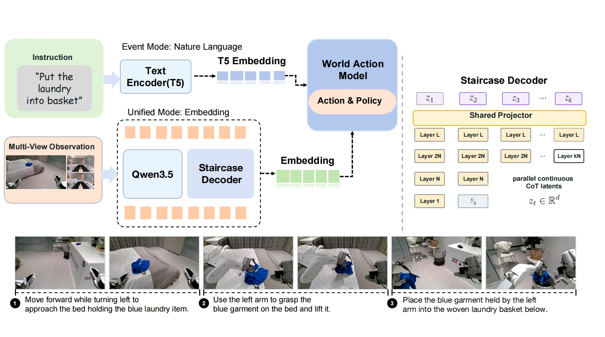

# X-Planner

### Event-Structured Task Planning for Embodied Intelligence

<p align="right">
  <strong>English</strong> | <a href="README_zh.md">简体中文</a>
</p>

X-Planner is a task-planning front end for long-horizon robot manipulation. Given a high-level
instruction, synchronized multi-view observations, and optional execution history, it represents
the next behavior as an action-grounded event and passes that representation to a downstream
world-action model.

<p align="center">
  
</p>

The project follows three ideas from the accompanying report:

- **Event-grounded data.** Demonstrations are synchronized and organized as a nested
  Task/Subtask/Action/Segment hierarchy.
- **Structured planning states.** Training examples materialize an initial plan, an ongoing event
  state, or an episode-end state as deterministic JSON.
- **Two planning interfaces.** Event mode exposes readable event states; unified mode uses compact
  latent planning states with Staircase Decoding.

> **Release-candidate status.** This branch contains the event-state data pipeline, Qwen3.5-VL
> training stack, event-mode inference, offline rollout evaluation, and public artifact contracts.
> Staircase Decoding code, model checkpoints, the 1,500-episode analysis media, and complete
> real-robot evaluation assets are not yet included. The repository must not be made public until
> the release gates in [docs/release_checklist.md](docs/release_checklist.md) are complete.

## News

- 2026-09: repository structure aligned with the X-Planner report and prepared for an initial
  open-source review.

## Repository layout

| Path | Contents |
| --- | --- |
| `x_planner/modeling/` | Qwen3.5-VL modeling extensions and vision-tower support |
| `x_planner/trainer/` | Distributed SFT launcher, model/data assembly, and trainer |
| `x_planner/data/pipeline/` | Episode normalization, hierarchy validation, and snapshot utilities |
| `x_planner/data/discovery/` | Scalable source discovery, validation, sampling, and immutable snapshots |
| `x_planner/data/context/` | Initial-plan and history-conditioned data construction |
| `x_planner/data/event_states/` | Current structured event-state materialization, holdout, training, and inference |
| `x_planner/evaluation/rollout/` | Offline prediction, rollout analysis, and review galleries |
| `scripts/` | User-facing training, inference, data-export, and evaluation entry points |
| `workspace/example/` | Portable example configuration; replace `/path/to/...` values locally |
| `datasets/analysis_subset/` | Contract for the 1,500-episode data-analysis artifact |
| `benchmarks/real_robot/` | Reported suites, Task Progress protocol, and aggregate results |

The public names intentionally describe responsibilities rather than internal experiment revisions.
Serialized artifacts still carry explicit schema versions so older snapshots can be audited.

## Installation

Create a Python 3.10 environment and install the training dependencies:

```bash
conda create -n xplanner python=3.10 -y
conda activate xplanner
pip install -e '.[train]'
```

X-Planner uses the data backend published as
[`X-Square-Robot/xDataset`](https://github.com/X-Square-Robot/xDataset). Install it beside this
repository:

```bash
git clone https://github.com/X-Square-Robot/xDataset.git ../xDataset
pip install --no-deps -e ../xDataset
```

For the exact CUDA-oriented environment used during development, see `environment.yml`. Install
FlashAttention separately when the target GPU supports it.

## Data preparation

Copy the example configuration and point its single source at a local indexed multimodal JSONL
dataset:

```bash
cp workspace/example/data/planner_sft.yml workspace/local_planner_sft.yml
```

Each event-state record contains synchronized views, a task instruction, optional plan/history
context, and one compact JSON target. The current schema and rendering logic live in
`x_planner/data/event_states/schema.py` and `x_planner/data/event_states/prompt.py`.

The full materialization workflow enforces an evaluation holdout by stable episode identity and
manifest SHA-256:

```bash
cp .env.example .env
# Fill XPLANNER_MODEL_PATH, XPLANNER_DATASET_REPO,
# XPLANNER_EVALUATION_MANIFEST, and XPLANNER_EVALUATION_SHA256.

bash scripts/train/train_event_planner.sh prepare \
  /path/to/event_snapshot /path/to/prepared_data
```

## Training

Run Qwen3.5-VL supervised fine-tuning with a portable data config:

```bash
MODEL_PATH=/path/to/Qwen3.5-9B \
DATA_CONFIG=workspace/local_planner_sft.yml \
OUTPUT_DIR=work_dirs/x_planner_sft \
bash scripts/train/train_qwen35_sft.sh 1 8
```

The event-state launcher currently exposes bounded validation runs for the release candidate:

```bash
bash scripts/train/train_event_planner.sh unit
bash scripts/train/train_event_planner.sh smoke-single /path/to/event_snapshot
```

Its fail-closed checks verify the frozen snapshot digest, evaluation-holdout separation, loss-mask
contract, and resume metadata before optimization.

## Inference

Generate structured event states from a trained checkpoint:

```bash
python scripts/inference/run_event_planner.py \
  --checkpoint /path/to/checkpoint \
  --snapshot /path/to/event_snapshot \
  --output-dir work_dirs/inference
```

Predictions are parsed and validated against the same compact JSON contract used for training.

## Evaluation

The repository separates three different artifacts that were previously conflated:

1. `datasets/analysis_subset/` describes the deterministic 1,500-episode subset used only for
   semantic and temporal coverage analysis.
2. `benchmarks/real_robot/` describes the Reasoning Manipulation and Generalization suites reported
   with the Task Progress metric.
3. An evaluation-holdout manifest is supplied locally to training and is never treated as training
   data.

General multimodal evaluation wrappers are also provided:

```bash
CKPT=/path/to/checkpoint bash scripts/evaluation/run_lmms_eval.sh mmstar 0
CKPT=/path/to/checkpoint TASKS=erqa,vsibench \
  bash scripts/evaluation/run_embodied_benchmarks.sh
```

See [benchmarks/README.md](benchmarks/README.md) for what is reproducible now and which media,
per-trial records, and scoring rubrics still need release approval.

## Models and datasets

- X-Planner checkpoints: **coming soon**.
- Event-grounded training dataset: **coming soon, subject to source-by-source approval**.
- 1,500-episode analysis subset with materialized multi-view images: **export tooling ready; artifact
  release pending approval**.

Model weights and full media should be versioned outside the Git repository. The code repository
pins their release IDs and checksums.

## Citation

The citation will be added when the X-Planner report receives a stable public identifier.

## License

The source code in this repository is released under the [MIT License](LICENSE). Model weights,
datasets, media, and third-party components remain subject to their respective licenses and usage
terms. See [docs/data_sources.md](docs/data_sources.md) before redistributing derived artifacts.
